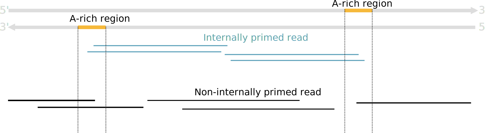
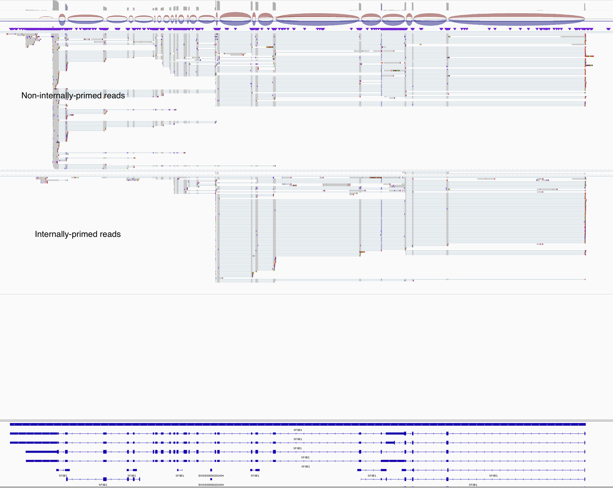

# PrimSpotter: Detecting Internal Priming Artifacts in RNA-seq Data

PrimSpotter is a tool to identify and characterize internal priming artifacts in RNA-seq data, especially those caused by A-rich genomic regions that lead to spurious priming events.

## Purpose

Reverse transcription in RNA-seq can occasionally initiate at internal A-rich regions of transcripts rather than true poly(A) tails, leading to false-positive transcript ends. This artifact can affect transcript assembly, quantification, and downstream analysis.

This tool identifies such artifacts by scanning the genome for A-rich regions and cross-referencing them with RNA-seq read alignments to flag likely internally primed reads.

## Algorithm Overview



### Step 1: Detect A-Enriched Genomic Regions

1.1. **Sliding Window Search**  
Scan the genome using a sliding window of size 10 nucleotides.  
Select windows that contain **≥ 8 As** (on the forward strand) or **≥ 8 Ts** (equivalent to 8 As on the reverse strand), depending on which strand the genes came from.

1.2. **Merge Overlapping Windows**  
Merge overlapping or adjacent enriched windows into larger contiguous regions.

1.3. **Region Extension**  
Extend each merged region by **25 nucleotides** upstream and downstream to accommodate read alignment variability.

1.4 **A-rich region filtering**
Filter out A-rich regions that overlap the annotated transcript termination sites.

### Step 2: Flag Internally Primed Reads

2.1. **Read Categorization**  
Label a read as an **internally primed read** if:
- It **ends** within an A-rich region, or  
- It **starts** within a T-rich region

## Usage

```
python3 PrimSpotter/PrimeSpotter.py --bam_file {input bam} \
                                --genome-ref {input genome} \
                                --gtf_file {input gtf} \
                                --output-summary {output summary filename} \
                                --output-gene-count {output gene counts file name} \
                                --processes {n cpus}| samtools view -S -b | samtools sort > {output.bam}
```

## Output:
1. Sorted bam file with the internally primed reads flagged as `T` as the IP tag, otherwise `F`
2. A summary txt file report the number and proportion of internally primed reads.
3. A table counting the number of internally primed (IP) reads versus non-IP reads. The table contains the following columns:
 - Gene_id : Gene id
 - IP_count: count of IP reads
 - nonIP_count: count of non-IP reads
 - Skipped_reads: count of undetermined reads
 - n_site_filtered: Number of A-rich regions detected for the gene (**after** filtering for annotated transcript termination sites)
 - n_site_unfiltered: Number of A-rich regions detected for the gene (**without** filtering for annotated transcript termination sites)
## Example result:


## License

GPL3 License
